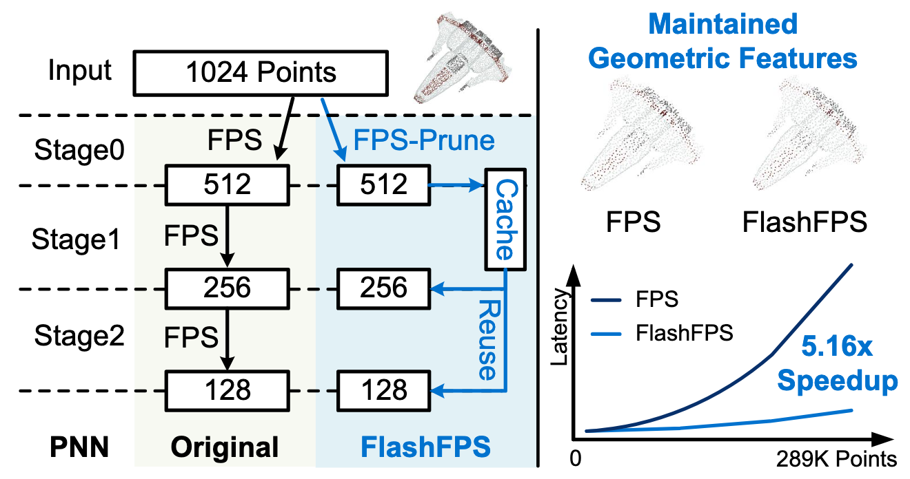

# FlashFPS

[](https://arxiv.org/abs/2604.17720)
[](https://dac.com/2026)
[](https://opensource.org/licenses/MIT)

Official PyTorch implementation for the DAC'26 paper:

**FlashFPS: Efficient Farthest Point Sampling for Large-Scale Point Clouds via Pruning and Caching**

*by [Yuzhe Fu](https://yuzhe-fu.github.io), [Hancheng Ye](https://hanchengye.com), [Cong Guo](https://guocong.me), [Junyao Zhang](https://jjjayyyy.github.io), [Qinsi Wang](https://wangqinsi1.github.io), [Yueqian Lin](https://yueqianlin.com), [Changchun Zhou](https://changchun-zhou.github.io), [Hai "Helen" Li](https://ece.duke.edu/people/hai-helen-li/), [Yiran Chen](https://ece.duke.edu/people/yiran-chen/).*


## Demo of FlashFPS on PointNeXt-L @ S3DIS segmentation

https://github.com/user-attachments/assets/f93ceb50-9d5a-4d25-b734-238c429c9592

<p align="center">
  
</p>

## Abstract

[FlashFPS](https://arxiv.org/abs/2604.17720) is a hardware-agnostic, plug-and-play framework for efficient Farthest Point Sampling (FPS) in point cloud networks. It achieves on average end-to-end **5.16× speedup** over the standard CUDA baseline on GPU, with negligible accuracy loss.

This repository reproduces the network accuracy and speedup performance reported in the paper. This repo currently supports FPS-CUDA, **FlashFPS**, and the SOTA work QuickFPS on the following workloads:

| Network Models | Main Library | Datasets | Supported Methods |
| :--- | :--- | :--- | :--- |
| PointNeXt-L, PointVector-L | openpoints | S3DIS, ScanNet | FPS-CUDA, ***FlashFPS***, QuickFPS |

Detailed setup and experiment instructions are in the sub-folders below:

- [`FlashFPS-Openpoints/`](./FlashFPS-Openpoints/README.md) &nbsp;— PointNeXt / PointVector on the openpoints backbone. **Ready to use.**
- [`FlashFPS-PointTransformer/`](./FlashFPS-PointTransformer/README.md) &nbsp;— Point Transformer backbone. **To be released.**

> **Hardware note.** We recommend TITAN-class, RTX 6000, RTX 3090, or A100 GPUs (all tested successfully). Hopper-architecture GPUs (e.g., H100) are **not** recommended. All reported numbers in this repo were obtained on TITAN GPUs for consistency. 

> Minor accuracy variations may occur across GPU architectures due to GPU-dependent numerical behavior; they do not affect the overall conclusions.


## Todo

- [x] Support **FlashFPS** and FPS-CUDA for PointNeXt-L and PointVector-L.
- [x] Add QuickFPS for PointNeXt-L and PointVector-L.
- [ ] Support **FlashFPS** on Point Transformer.
- [ ] Support **FlashFPS** performance breakdown.


## Citation

```tex
@article{fu2026flashfps,
  title={FlashFPS: Efficient Farthest Point Sampling for Large-Scale Point Clouds via Pruning and Caching},
  author={Fu, Yuzhe and Ye, Hancheng and Guo, Cong and Zhang, Junyao and Wang, Qinsi and Lin, Yueqian and Zhou, Changchun and Li, Hai Helen and Chen, Yiran},
  journal={arXiv preprint arXiv:2604.17720},
  year={2026},
  doi={10.48550/arXiv.2604.17720},
}
```

<!-- ```tex
@inproceedings{fu2026flashfps,
  title     = {FlashFPS: Efficient Farthest Point Sampling for Large-Scale Point Clouds via Pruning and Caching},
  author    = {Fu, Yuzhe and Ye, Hancheng and Guo, Cong and Zhang, Junyao and Wang, Qinsi and Lin, Yueqian and Zhou, Changchun and Li, Hai Helen and Chen, Yiran},
  booktitle = {Proceedings of the 63rd ACM/IEEE Design Automation Conference (DAC)},
  year      = {2026},
  publisher = {ACM}
}
``` -->


## Related Project — FractalCloud [](https://ieeexplore.ieee.org/document/11408589)
**FlashFPS** optimizes the Farthest Point Sampling, delivering an average **5.16× end-to-end speedup** on GPUs, and no hardware changes required. If you are interested in **full-stack hardware–software co-design** of point neural networks (PNNs), please check out our another work:

**[FractalCloud: A Fractal-Inspired Architecture for Efficient Large-Scale Point Cloud Processing](https://ieeexplore.ieee.org/document/11408589)**, which achieves an average **21.7× speedup** on PNN inference through a co-designed accelerator.  
Repository: [FractalCloud](https://github.com/Yuzhe-Fu/FractalCloud)
> **Tip:** FlashFPS and FractalCloud share the **same environment**. If you've already set up one, the other runs out of the box ^_^


## Acknowledgment

This repository builds upon [FractalCloud](https://github.com/Yuzhe-Fu/FractalCloud), [PointNeXt](https://github.com/guochengqian/PointNeXt) and [OpenPoints](https://github.com/guochengqian/openpoints). The QuickFPS implementation is adapted from [QuickFPS](https://github.com/hanm2019/bucket-based_farthest-point-sampling_GPU) and [FastPoint](https://github.com/SNU-ARC/FastPoint). We thank the authors for their open-source contributions.
